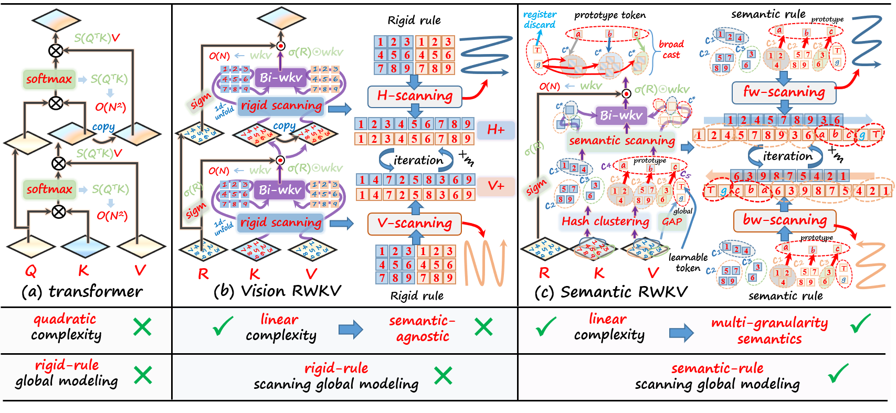
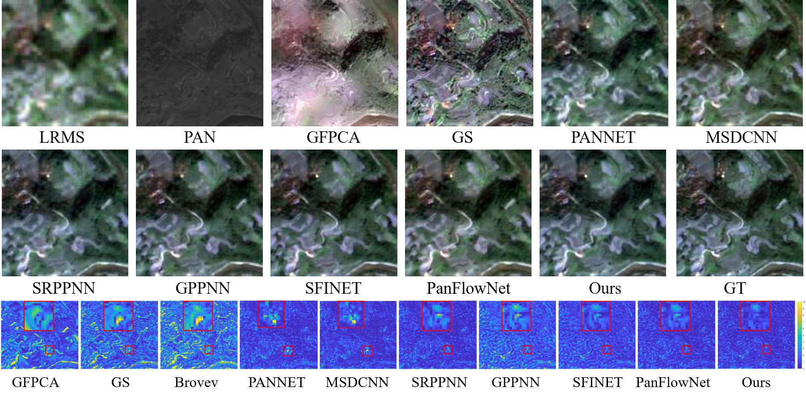

# CVPR 2026 Highlight: Multigrain-aware Semantic Prototype Scanning and Tri-Token Prompt Learning Embraced High-Order RWKV for Pan-Sharpening

<p align="center">
  <a href="https://img.shields.io/badge/CVPR-2026-0A66C2.svg"></a>
  <a href="https://img.shields.io/badge/Task-Pan--sharpening-1F7A8C.svg"></a>
</p>

<p align="center">
  Junfeng Li<sup>1,2,&dagger;</sup>,
  Wenyang Zhou<sup>3,&dagger;</sup>,
  Xueheng Li<sup>4</sup>,
  Xuanhua He<sup>5</sup>,
  Jianhou Gan<sup>2,*</sup>,
  Wenqi Ren<sup>1,6,*</sup>
</p>

<p align="center">
  <sup>1</sup>Shenzhen Campus of Sun Yat-sen University
  &nbsp;&nbsp;
  <sup>2</sup>Yunnan Normal University, Ministry of Education
  &nbsp;&nbsp;
  <sup>3</sup>Xidian University
  <br>
  <sup>4</sup>University of Science and Technology of China
  &nbsp;&nbsp;
  <sup>5</sup>The Hong Kong University of Science and Technology
  &nbsp;&nbsp;
  <sup>6</sup>MoE Key Laboratory of Information Technology
</p>

<p align="center">
  <sub>&dagger; Equal contribution. * Corresponding authors.</sub>
</p>

<p align="center">
  <a href="#results"><strong>Results</strong></a>
  ·
  <a href="#status"><strong>Status</strong></a>
  ·
  <a href="#citation"><strong>Citation</strong></a>
</p>

<p align="center">
  
</p>

> **Status**
> This repository currently hosts the project overview and figures.


## Overview

This work introduces a high-order RWKV framework for pan-sharpening that replaces rigid raster scanning with **semantic-guided token reordering**, injects **tri-token prompts** for semantic conditioning and artifact suppression, and preserves fine spatial details with an **invertible multi-scale Q-shift** design.

Compared with existing RWKV-style global modeling, the method is built to be more semantic-aware, more stable in feature fusion, and more effective at recovering high-frequency structures in remote sensing imagery.


## Results

Our method achieves the best reported performance in the paper on **WorldView-II**, **WorldView-III**, and **GaoFen2**.

| Dataset | PSNR | SSIM | SAM | ERGAS |
| --- | ---: | ---: | ---: | ---: |
| WorldView-II | **42.3751** | **0.9737** | **0.0208** | **0.8816** |
| WorldView-III | **31.3113** | **0.9319** | **0.0685** | **2.8361** |
| GaoFen2 | **47.8941** | **0.9901** | **0.0097** | **0.5115** |


<p align="center">
  
</p>

## Status

- Available now: project overview, figures, and reported benchmark results.


## Citation

If you find this work useful, please cite our paper as follows. The proceedings version is to appear in CVPR 2026.

```bibtex
@inproceedings{li2026multigrain,
  title={Multigrain-aware Semantic Prototype Scanning and Tri-Token Prompt Learning Embraced High-Order RWKV for Pan-Sharpening},
  author={Li, Junfeng and Zhou, Wenyang and Li, Xueheng and He, Xuanhua and Gan, Jianhou and Ren, Wenqi},
  booktitle={Proceedings of the IEEE/CVF Conference on Computer Vision and Pattern Recognition (CVPR)},
  year={2026},
  note={to appear}
}
```
